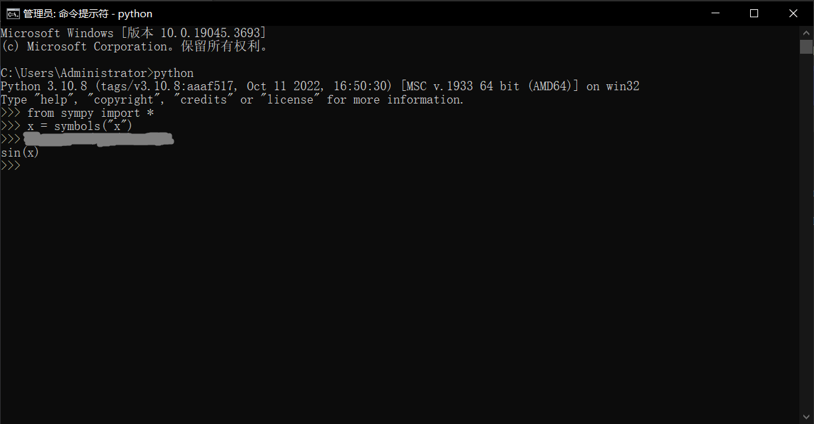

# 软件组第二次考核任务——Python相关

>   **前言**
>相信大家经过C++的考核，已经对C++的语言基础有了一定了解。接下来，我们将带你在Python的代码世界里遨游(≧∇≦)ﾉ

**==出于个人的考虑，我将使用我自己设置的任务进行考核。==**

这是原本的Python考核任务内容

>   <a href="https://gitee.com/ronald-luo/exam_for_software_of_drb_of_2023/blob/master/docs/assets/%E7%AC%AC%E4%BA%8C%E6%AC%A1%E8%80%83%E6%A0%B8Python.zip" download="第二次考核Python.zip">第二次考核Python.zip</a>

大家如果想查看可以下载查看，想进行尝试的话也可以(想提交给我也行)

---

## 任务一（5分）

下载 <a href="https://gitee.com/ronald-luo/exam_for_software_of_drb_of_2023/blob/master/docs/assets/lab01.zip" download="lab01.zip">`『lab01.zip』`</a>，将压缩包中的 `lab01` 文件夹解压后，用 :simple-powershell: **PowerShell** 或者 **命令提示符cmd** 打开 `lab01` 文件夹，如图


然后通过运行

```bash
python ok --local
```

来开启测试题，全部通过后，将有类似于如下的显示（ `x test cases passed! No cases failed` ），


如果完成任务，请将此界面截图并保存(用于提交)。

**==任务要求==**：

自己学习 python 语言相关的语法，根据下面这个网站的指示，完成上面的测试题

 [Lab 1](assets/Lab 1_ Variables & Functions, Control _ CS 61A Fall 2020.html)

## 任务二（5分）

与**任务一**类似，

测试题文件： <a href="https://gitee.com/ronald-luo/exam_for_software_of_drb_of_2023/blob/master/docs/assets/lab02.zip" download="lab02.zip">`『lab02.zip』`</a>

指示网站：  [Lab 2](assets/Lab%202_%20Higher-Order%20Functions,%20Lambda%20Expressions%20_%20CS%2061A%20Fall%202020.html) 

同样地，如果完成任务，请将通过测试的界面截图并保存

## 任务三（任务四前置）

以下内容截取自原本的Python考核任务内容

>   <big>**环境配置**</big>
>
>   **请自己上网查找攻略，完成环境配置和IDE配置，搭建你自己的写代码平台~**
>
>   学会网上查找解决方法也是一项重要的技能，进入基地，你可能会遇到许多难以解决的bug（学长曾经深受其害＞﹏＜）。配环境时出现error是常有的事，我们希望你能在考核时就开始积攒经验。实在解决不了可以向学长求助！**学长们在空闲时间会很尽力解决大家的问题~**
>
>   <big>**Python的安装组件pip**</big>
>
>   pip主要用于安装和管理第三方组件模块，是随python环境的搭建一并设置到环境变量中的。
>
>   **pip常用指令**
>
>   pip list：查看当前模块库中已经安装的所有外部模块指令。
>
>   pip install 模块名称：在线安装外部模块指令（同时会自动下载安装与其相关依赖的模块库）。
>
>   pip uninstall 模块名称：从模块库中删除指定的模块指令。
>
>   pip install --upgrade 模块名称：升级指定的模块到最新的版本。
>
>   **pip换源**
>
>   使用pip下载许多国外的模块的时候，由于网络限制，常常下载失败┌(。Д。)┐。
>
>   这时就要给pip的下载源换成国内的镜像地址，如清华、豆瓣、阿里等。
>
>   **请选择你喜欢的一个镜像，完成换源操作。**

## 任务四（4分）

安装 `sympy` 包，

>   -   [Quick examples · sympy/sympy Wiki (github.com)](https://github.com/sympy/sympy/wiki/Quick-examples)
>   -   [SymPy 1.12 documentation](https://docs.sympy.org/latest/index.html)

根据上面这两个网站（第一个网站是 sympy 官方 github 仓库 wiki 中给的几种简单用法的代码示例，第二个网站是 sympy 的官方文档）或者其他自行查找到的信息，来使用这个包来解决以下的两个数学问题：

-   [x] $$
    z = \sin{\left(x y \right)} + \cos^{2}{\left(x y \right)}
    $$

    求 $z(x, y)$ 的三阶偏导数 $z_{xyy}$ 即 $\frac{ \partial ^3 z }{ \partial x \partial y ^2 }$

-   [x] $$
    f(x) = \frac{ 3 x^{4} + 2 x^{2} }{ x^{2} + 1 }
    $$

<<<<<<< HEAD
    求 $\int f(x) \ \mathrm{d}x$ 

请将计算的运行结果截图，类似下图（求 $\int \cos{x} \ \mathrm{d}x$ ）
=======
    求 $\int f(x)\mathrm{d}x$ 

请将计算的运行结果截图，类似下图（求 $\int \cos{x} \mathrm{d}x$ ）
>>>>>>> 575cf74df18b72fcbcca5084287417b3d66f6247



## 任务五（2分）

以下内容截取自原本的Python考核任务内容

><big>**Python环境管理——Anaconda**</big>
>
>在配置各种各样的Python模块时，如果不使用多个虚拟环境，可能会造成许多环境重合在一起变得非常杂乱的问题，这样也不便于环境的管理，于是，Anaconda它来了。
>
>**请安装Anaconda，并换源。**
>
>**学习Anaconda的基础命令操作。**

任务要求，创建一个 conda 环境命名为 `test` ，并启动这个环境，在这个环境中列出所有 conda 环境，并将这个界面截图，类似下图


## 提交各任务完成情况

将截图打包，并发送到 [`1239751758@qq.com`](mailto:<1239751758@qq.com>)

